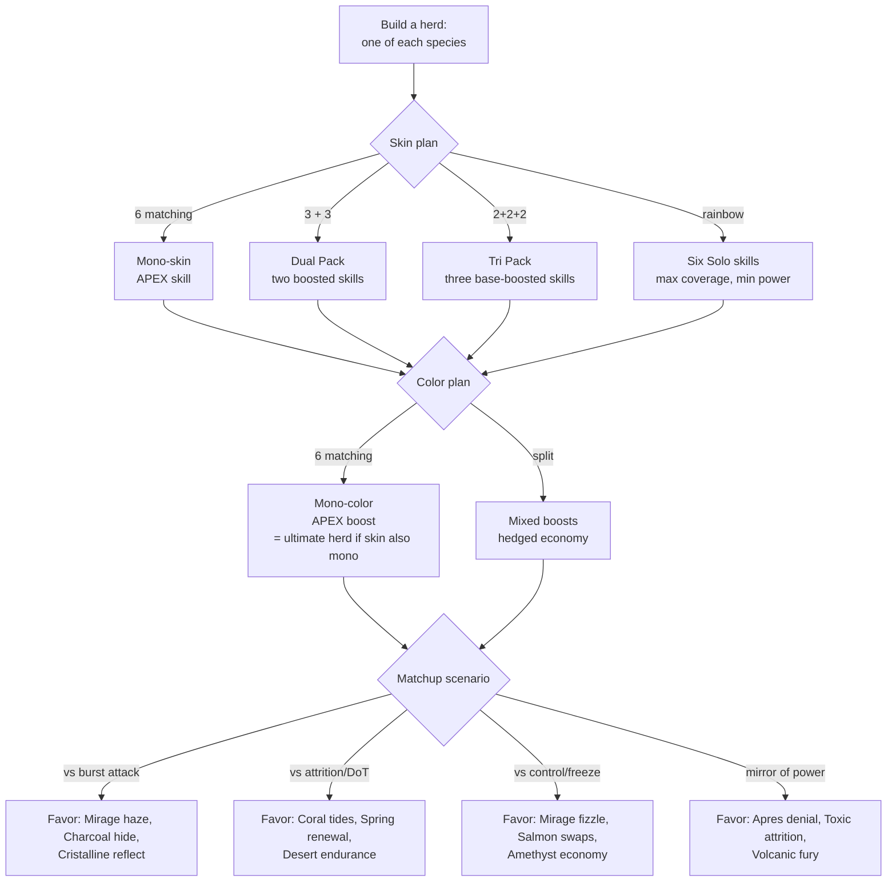

# Skin Skills & Color Boosts — Design

Status: **proposal** (rules version target: `herd-alpha-2`)

This document designs the next evolution of the bond system: every skin grants a
**Skill**, every color grants a **Boost**, and both scale with how many herd
companions share the trait. A herd of one-of-each-species, all matching skin
*and* color, is the apex build — but mixed herds trade peak power for coverage
and counterplay.

## 1. The real trait space (research)

Verified against HowRare.is collection data (July 2026).

**Claynosaurz Genesis** — 10,222 characters, 7 species (Ankylo, Bronto, Dactyl,
Raptor, Rex, Stego, Trice).
**The Call of Saga** — 2,000 characters, 2 species (Para 998, Spino 998).
Both collections share the same Skin and Color trait space.

### Skins (10) — ordered rarest → most common (Genesis counts)

| Skin | Genesis | Saga | Theme |
| --- | ---: | ---: | --- |
| Apres | 281 | 61 | Alpine snow, ski resort |
| Toxic | 587 | 122 | Venom, sting |
| Elektra | 784 | 160 | Electricity |
| Coral | 805 | 175 | Beach, reef |
| Oceania | 814 | 164 | Deep ocean |
| Cristalline | 893 | 181 | Crystal, gemstone |
| Savanna | 1,154 | 233 | Grassland pack hunters |
| Jurassic | 1,227 | 238 | Primal jungle |
| Amazonia | 1,358 | 279 | Rainforest |
| Mirage | 2,083 | 383 | Desert illusion |

### Colors (8) — ordered rarest → most common

There are exactly eight clay skin colours. (Marketplace facets list "Salmon"
for Call of Saga, but that is a **background** colour trait, not a clay
colour — background traits are ignored by the game entirely.)

| Color | Genesis | Saga | Note |
| --- | ---: | ---: | --- |
| Mist | 388 | 83 | |
| Charcoal | 484 | 105 | |
| Amethyst | 889 | 143 | |
| Spring | 977 | 219 | |
| Aqua | 1,703 | 336 | Currently misfiled as a skin in the engine |
| Tropic | 1,710 | 345 | |
| Desert | 1,877 | 376 | |
| Volcanic | 1,958 | 389 | Currently misfiled as a skin in the engine |

Design consequence: rarity ranks the skill power ceiling. The requested ranking
(Apres > Toxic > Elektra > Coral) is exactly Genesis rarity order — the rule
generalises to all ten skins, **and to species**: rarer species (Saga Para/Spino
at 998 each, Raptor at 1,251, Bronto at 1,400) carry a higher ceiling than
common ones (Rex at 2,135). Rare traits are harder and more expensive to
collect, so their ceiling is allowed to *grow over time* through the
progression layer (§9) — new apex riders ship to the rarest traits first.

## 2. Design principles

1. **The 24-point stat budget is untouchable.** Skills and boosts are bounded
   battlefield behaviours, never raw stat inflation. Rarity buys *flavour
   ceiling*, not stat totals (fairness model in the README).
2. **Deterministic.** Every proc derives from seed + state, no dice.
3. **Companion scaling, not all-or-nothing.** Today's bond requires a full
   matching herd. The new model grades by count, so partial stacks matter and
   mixed herds are real strategies.
4. **One skill activation per skin per round** (team-wide), so stacking bodies
   raises tier, not proc count. Keeps rounds readable.
5. **Every displayed effect is implemented.** No promise the engine doesn't keep.

## 3. Companion tiers

**Tiers are dynamic: only standing (non-defeated) members count.** Knocking out
two dinos of a six-Apres herd drops it from Full Herd to Pride mid-battle, so
focus-firing the right species first is a real strategic lever — you can break
an apex before it breaks you.

Count standing members sharing the trait value across the whole herd (active +
reserve):

| Tier | Matching members (Core Six) | Skill strength |
| --- | --- | --- |
| Solo | 1 | Base effect |
| Pack | 2–3 | Boosted effect |
| Pride | 4–5 | Strong effect + secondary rider |
| Full Herd | 6 (all) | Apex effect (today's bond, upgraded) |

Genesis Seven and Complete Nine shift the bands: Pack 2–3, Pride 4–6, Full Herd
= format size. A herd can hold several trait groups at once: 3 Apres + 3 Toxic
runs both skills at Pack tier. Colors use the same bands independently, so
skin and color composition are two separate strategic dials.

## 4. The ten Skin Skills

Trigger rule: a skill procs from the *carrier* — the first eligible member to
act that round (attack skills proc on strike, defence skills on guard/being
struck). One proc per skin per team per round.

| Skin | Skill | Solo | Pack | Pride | Full Herd (apex) |
| --- | --- | --- | --- | --- | --- |
| **Apres** — Whiteout | Strikes Chill; 2 Chills = Frozen (action cancelled) | Chill on first strike only | Chill on every strike (current behaviour) | Freeze threshold stays 2, frozen target also −1 Clay to its team | **Avalanche**: first freeze each match also Chills adjacent enemies |
| **Toxic** — Envenom | DoT 4/round for 2 rounds, guard-ignoring | 2 dmg, 1 round | 4 dmg, 2 rounds (current) | Venom also reduces target healing 20% | **Neurotoxin**: venom on 2 stacks slows target (−2 speed) |
| **Elektra** — Arc | First strike arcs lightning to a second enemy | Arc 3 | Arc 5 (current) | Arc 5 to two extra enemies | **Overload**: arcs also drain 1 Clay from the enemy pool (once/round) |
| **Coral** — Tides | End-of-round healing to actives | Tide 2 | Tide 3 + first heal +6 (current) | Tide 4, also cures one Chill/Venom stack per round | **Spring tide**: once per match, fully cleanse team statuses |
| **Oceania** — Undertow | Positional drag | Substitutions against you cost +0 (no effect solo) | Once/round your strike on a Wing pulls it to Vanguard next round | Undertow also −1 enemy speed that round | **Riptide**: once per match force an enemy substitution |
| **Cristalline** — Facet | Reflect a share of received strike damage | Reflect 10% of first hit | Reflect 15% of first hit | Reflect 15% of first two hits | **Prism**: reflects also splash 3 to attacker's neighbour |
| **Savanna** — Pack Hunt | Focus-fire reward | +2 dmg when two allies strike the same target | +4 dmg | +4 dmg and the pack ignores 10% of target guard | **Stampede**: three-ally focus knocks the target to reserve if it survives below 25% |
| **Jurassic** — Primal Roar | Intimidation | First enemy striker −1 power this round | −2 power | Roar hits all enemy actives | **Apex Predator**: round 1 roar also delays enemy masteries by one round |
| **Amazonia** — Overgrowth | Entangle | Enemy substitutions cost +1 Clay | Also first enemy substitution each round is delayed to round end | Entangled actives −1 speed | **Canopy**: your reserves take no fatigue and heal 2/round |
| **Mirage** — Heat Haze | Evasion | First strike against you each match deals −25% | −25% first strike each round | Also the first arc/venom/chill against you each match fizzles | **Sandstorm**: once per match all strikes against you −25% for a round |

Rarity discipline: Apres/Toxic (rare) get denial and attrition — the strongest
verbs. Mirage/Amazonia (common) get defensive value that is excellent at Pack
tier but has a lower apex ceiling. Common skins are easy to stack (2,083
Mirages exist) so their per-tier numbers stay modest.

## 5. The eight Color Boosts

Colors are passive, economy- and stat-adjacent — they never deny actions.
Boost strength uses the same tiers (Solo / Pack / Pride / Full Herd).

| Color | Boost | Scaling Solo → Apex |
| --- | --- | --- |
| **Mist** | Phantom: speed priority bonus | +0 → +1 speed (priority only) → +1 speed → first substitution each round is untargetable that round |
| **Charcoal** | Cinder hide: flat damage reduction | 0 → 2 → 3 → 4 flat off every strike received |
| **Amethyst** | Focus: mastery economy | — → masteries cost −0 → masteries −1 Clay → +1 max Clay cap |
| **Spring** | Renewal: regeneration | 0 → heal 1/round → 2/round → 3/round on actives |
| **Aqua** | Flow: guard efficiency | — → guard 27% → guard 30% → substituted-in dinos gain 10% DR (current aqua effect) |
| **Tropic** | Sunburst: early tempo | — → +1 Clay round 1 → +1 Clay rounds 1–2 → start with an extra card in hand |
| **Desert** | Endurance: late game | — → first fatigue negated → fatigue −50% → +2 speed after round 8 |
| **Volcanic** | Fury: wounded damage | — → +5% dmg below half HP → +10% (current volcanic effect) → +10% and survive one lethal hit at 1 HP (once/match) |

## 6. The herd-building game tree

### Counter-relationships (rock-paper-scissors seams)

| Attacking plan | Countered by | Why |
| --- | --- | --- |
| Apres freeze-lock | Mirage (fizzles first chill), Salmon (swap out chilled dinos) | Denial needs consecutive hits on one body |
| Toxic attrition | Coral tides + Spring renewal (out-heal), Desert (outlast) | DoT loses to sustained recovery |
| Elektra arcs | Cristalline reflect, Charcoal flat reduction | Small repeated hits are erased by flat/reflect defence |
| Savanna focus-fire | Oceania undertow (scrambles formation), Mist phantom swaps | Pack Hunt needs a stable target |
| Turtle/guard stalls | Toxic (guard-ignoring), Apres (guard doesn't stop chill), round cap | Anti-stall pressure valves |

The intended meta: mono herds are the strongest *straight line*; splits are
insurance policies that beat specific apexes. A 3 Apres + 3 Coral herd
sacrifices Avalanche but holds freeze pressure *and* out-heals Toxic.

### Worked archetypes

- **The Ultimate** — 6 species, all Apres, all Mist: apex freeze denial with
  phantom speed. Astronomically rare to own; this is the collector summit.
- **Frost & Tide (3 Apres / 3 Coral, mono-Spring)** — control + sustain.
- **Storm Pack (3 Elektra / 3 Savanna, mono-Volcanic)** — focus-fire burst
  that gets scarier as it bleeds.
- **The Wall (6 Cristalline, 4 Charcoal / 2 Aqua)** — reflect turtle; the
  round cap and Toxic are its natural enemies.
- **Saga Skirmishers (Complete Nine with a Para/Spino pair)** — the only route
  to the nine-strong formats; Saga species are the rarest bodies in the game
  (998 each) and sit at the top of the species-ceiling curve.

## 7. Engine changes (implementation plan)

1. **Data layer** — `src/data/traitCatalog.ts`: canonical `Skin` and `Color`
   enums with per-collection counts (tables above), replacing ad-hoc strings.
   Migration: current "aqua"/"volcanic" *skin* bonds re-key as color boosts.
2. **Composition engine** — `herdComposition(members)` returns
   `{ skinCounts, colorCounts, tier(skin), tier(color) }`; replaces the single
   `HerdBond` with a `HerdProfile { skills: SkinSkillState[], boosts: ColorBoostState[] }`.
   `HerdBond` stays as a derived label for published-herd back-compat.
3. **Status/skill framework** — generalise the status system (chill, frozen,
   venom already exist) with: `power-down` (Jurassic), `entangle` (Amazonia),
   `haze` charges (Mirage), reflect (Cristalline), pull (Oceania). One
   proc-per-skin-per-round bookkeeping on `BattleTeamState`.
4. **Tier tuning table** — all numbers in one `SKILL_TIERS` /`BOOST_TIERS`
   constant file so balance passes never touch engine logic.
5. **UI** — Workshop: live composition meters ("Apres 3/6 — Pack") while
   picking; Battle: skill proc lines in the log (already the pattern) + tier
   badges on the team header.
6. **Tests** — one suite per skill and boost at each tier boundary (Solo/Pack/
   Pride/Apex), plus meta-invariants: no skill modifies base stats; a rainbow
   herd's six Solo skills never exceed a mono herd's apex output in a scripted
   benchmark battle.
7. **Rollout** — rules version `herd-alpha-2`; published `herd-alpha-1` herds
   still battle (bond → derived profile), Workshop republish upgrades them.

Suggested build order: 1 → 2 (with old effects mapped into the new framework at
current numbers) → 5 Workshop meters → 3 new skills in rarity order (Apres
apex first, Mirage last) → 4/6 continuously → 7.

## 8. Decisions (resolved)

1. **Tiers are dynamic** — standing members only. Defeats strip tiers, so
   target priority ("break the apex") is core strategy. (Decided 2026-07-21.)
2. **Salmon is a background colour trait and is ignored.** The game reads
   exactly eight clay colours. Background, Mood and Motion traits never affect
   battle.
3. **Ancients get a unique battle role** — see §10.
4. Class–skill interaction stays class-agnostic in alpha-2 (the carrier rule
   only decides *who* procs). A future layer may add class-flavoured skill
   expressions.

## 9. Progression: the growing ceiling

Rarity should pay off more as the game matures, without breaking the equal
stat budget. The mechanism is **Collector Level** (earned from battles played,
won, and herds published — not from spending):

- Tiers Solo→Full are available to everyone from level 1; the *numbers* above
  are the permanent baseline.
- New **apex riders** ship in seasons, gated by Collector Level milestones and
  released in rarity order — Apres and the Saga species get their new riders
  first, Mirage and Rex last. Rare traits therefore appreciate in gameplay
  ceiling over time, mirroring how they appreciate as collectibles.
- Levels never buy stats. They unlock *access* (riders, formats, Ancient
  content below), keeping the fairness model intact.

## 10. Ancients (the 22 one-of-ones)

Ancients are too singular to be ordinary herd members. Three roles, phased:

1. **Boss battles (first, PvE)** — each Ancient is a scripted raid boss that
   unlocks at Collector Level milestones. It fights *alone against a full
   herd* with a boosted solo statline (the one sanctioned budget exception,
   PvE-only), its own signature skill line, and multi-phase behaviour.
   Beating an Ancient grants level XP and a cosmetic badge on your published
   herds. This makes Ancients content everyone can experience.
2. **Relic patronage (holders)** — the wallet that owns an Ancient may attach
   it to a published herd as a non-combatant **Patron**: it does not battle,
   but grants the herd one extra apex rider slot or a once-per-match signature
   intervention. Requires a Collector Level floor so it is earned, not
   default-on.
3. **Champion mode (later, opt-in queue)** — Ancient vs Ancient or
   Ancient-vs-herd exhibition battles in a separate ladder, so PvP herd
   balance is never distorted.

Ownership is revalidated the same way Mastered classes are (on-chain check at
publish + periodic revalidation).

## Sources

- HowRare.is Claynosaurz trait tables — https://howrare.is/claynosaurz
- HowRare.is Call of Saga trait tables — https://howrare.is/thecallofsaga
- Claynosaurz GitBook, The Collections — https://claynosaurz.gitbook.io/home/about-claynosaurz/the-collections
- Call of Saga announcement — https://x.com/Claynosaurz/status/1648049243452592138
